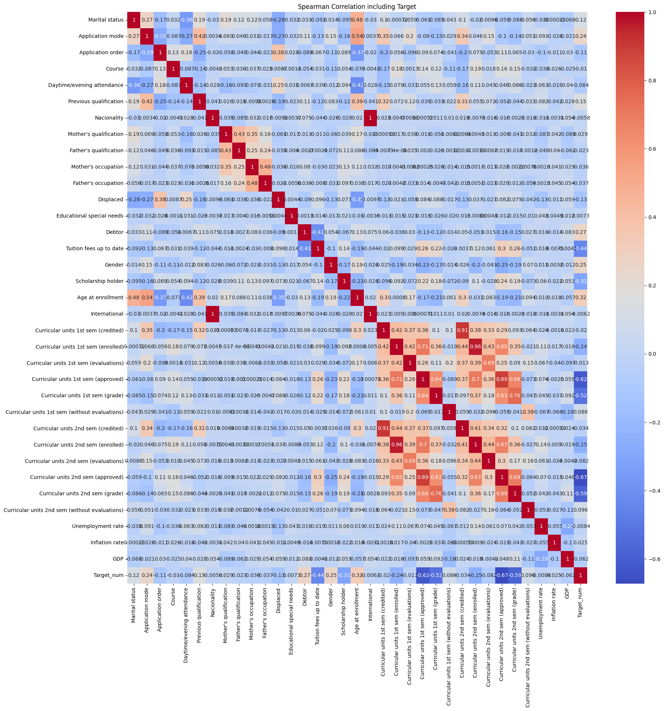
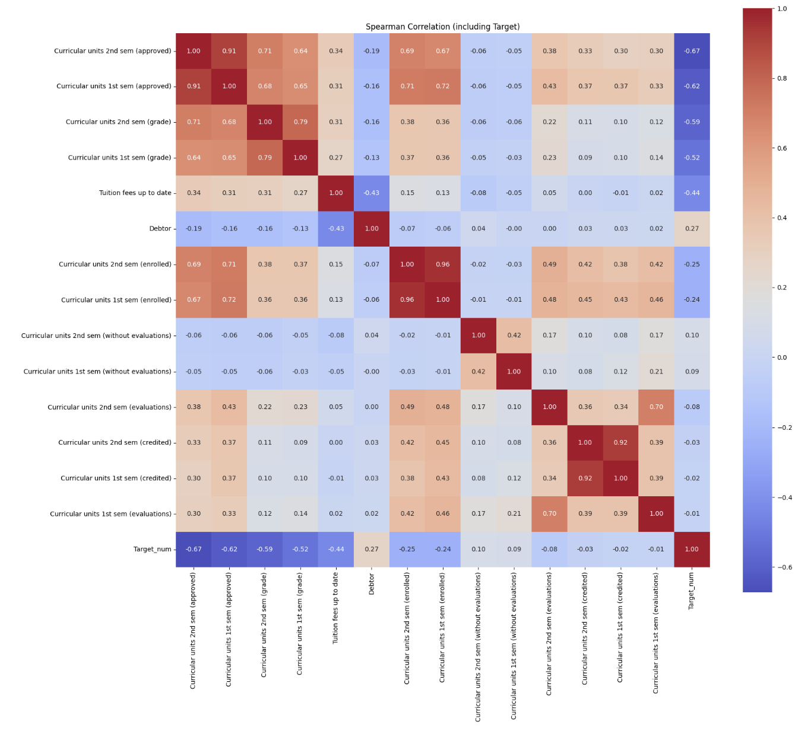

# SKN20-2nd-4TEAM  
# 🎓 학생 학업 중도 이탈률 예측 프로젝트  

---

## 👥 팀원 소개  
### 팀명 : Drop Signal Detector (자퇴 시그널 감지조)

<table>
  <tr>
    <td align="center">
       
      <b>김황현</b> 
      팀장 / 데이터 엔지니어 
      전체 프로젝트 기획, 파이프라인 설계 및 모델링 전략 수립
    </td>
    <td align="center">
       
      <b>이도경</b> 
      데이터 분석 담당 
      EDA, 전처리 및 변수 중요도 분석, 시각화 보고서 제작
    </td>
    <td align="center">
       
      <b>이지은</b> 
      머신러닝 담당 
      모델 학습 및 튜닝, 성능 평가, 피처 엔지니어링
    </td>
    <td align="center">
       
      <b>정소영</b> 
      딥러닝 담당 
      신경망 설계, 딥러닝 모델 구현 및 성능 비교
    </td>
    <td align="center">
       
      <b>최유정</b> 
      프론트엔드/UI 
      EDA, 데이터 전처리, Streamlit 화면 설계, GitHub 관리
    </td>
  </tr>
</table>

🔗 **GitHub Repository**: [SKNETWORKS-FAMILY-AICAMP / SKN20-2nd-4TEAM](https://github.com/SKNETWORKS-FAMILY-AICAMP/SKN20-2nd-4TEAM)

---

## 🧩 프로젝트 개요  

학생 개개인의 학적, 학업 성취, 재정 상태, 가정 요인 등을 종합 분석하여  
**학업 중도 이탈(Dropout) 가능성을 예측**하는 머신러닝 기반 프로젝트입니다.  

- **목표**: 학생이 졸업(Graduate) 혹은 자퇴(Dropout) 중 어떤 경로를 밟을지 사전에 예측  
- **데이터 출처**: [Predict Students’ Dropout and Academic Success (Kaggle)](https://www.kaggle.com/datasets/thedevastator/higher-education-predictors-of-student-retention)  
- **데이터 규모**: 4,424명 × 35개 변수  
- **주요 변수**: 학적, 학업 성취, 장학금, 등록금, 부모 학력·직업, 거시경제 변수 등  

---

## 📊 데이터 분석 및 전처리  

| 단계 | 주요 내용 |
|------|------------|
| 1️⃣ 데이터 확인 | 결측치 없음 / 수치형·범주형 혼합 데이터 |
| 2️⃣ 타깃 인코딩 | Dropout=1, Enrolled/Graduate=0 |
| 3️⃣ 필요 없는 컬럼 제거 | `Unemployment rate`, `Nacionality`, `Course` 등 6개 제거 |
| 4️⃣ 범주형 처리 | One-Hot Encoding, Label Encoding 병행 |
| 5️⃣ 수치형 처리 | StandardScaler로 정규화 |
| 6️⃣ 불균형 데이터 대응 | `class_weight='balanced'` + `SMOTE` 적용 |

---

## 3. 📊 탐색적 데이터 분석 (EDA)

### 3-1. 상관행렬 (Heatmap)

  

> Spearman 상관계수를 기반으로 변수 간 관계를 분석했습니다.  
> `Curricular units`(학업 성취 변수)들이 상호 강한 양의 상관을 보였고,  
> `Debtor`, `Tuition fees up to date`, `Scholarship holder` 등 재정 요인이 이탈과 높은 음의 상관을 보였습니다.

---

### 3-2. 불필요 컬럼 제거 및 재확인

  

> `Course`, `Unemployment rate`, `Educational special needs` 등 학업 성취와 직접 관련이 낮은 변수는 제거.  
> 이후 상관 구조를 재확인한 결과, 주요 학업 변수 중심으로 정제된 데이터셋이 완성되었습니다.

---

### 3-3. 사용 컬럼 요약  

| 구분 | 컬럼 수 | 컬럼명 |
|------|----------|--------|
| ✅ **사용 컬럼 (28)** | 28 | `Age at enrollment`, `Application mode`, `Application order`, `Curricular units 1st/2nd sem (approved, grade, enrolled, evaluations...)`, `Daytime/evening attendance`, `Debtor`, `Displaced`, `Gender`, `Scholarship holder`, `Tuition fees up to date`, `Mother's qualification`, `Father's occupation`, `GDP`, `Inflation rate`, `Previous qualification`, `Marital status` 등 |
| ❌ **제거 컬럼 (6)** | 6 | `Course`, `Educational special needs`, `Father's qualification`, `International`, `Nacionality`, `Unemployment rate` |

> **제거 사유:**  
> - 개인 특성과 상관이 낮은 외부 변수(`Unemployment rate`, `Nacionality`)  
> - 불균형 또는 다중공선성(`Father's qualification`)  

---

## ⚙️ 사용 기술 스택  

| 구분 | 기술 |
|------|------|
| 언어 |  |
| 분석 |   |
| 모델링 |   |
| 시각화 |   |
| 웹 |  |
| 협업 |   |

---

## 🤖 머신러닝 및 딥러닝 모델링  

| 모델 | Accuracy | F1 Score | AUC |
|------|-----------|----------|-----|
| Logistic Regression | 0.90 | 0.91 | 0.93 |
| Random Forest | 0.91 | 0.93 | 0.94 |
| XGBoost | 0.91 | 0.92 | 0.93 |
| **LightGBM (최종)** | **0.93** | **0.934** | **0.942** |
| PyTorch MLP | 0.91 | 0.92 | 0.94 |

> **LightGBM**이 F1과 AUC에서 가장 높은 성능을 기록하여 최종 모델로 선정되었습니다.  
> 추가로 MLP 딥러닝 모델을 결합한 Soft Voting 앙상블 실험도 진행했습니다.  

---

## 💻 Streamlit 웹 서비스  

  

- 학생 정보 입력 시 Dropout 확률을 실시간으로 예측  
- 예측 확률에 따라 **Low / Medium / High Risk**로 자동 분류  
- 주요 변수 중요도(Feature Importance) 시각화  
- 불필요한 변수는 `only_test_streamlit_guidance.txt` 기준으로 UI에서 비활성화  

📺 **시연 영상:** (추후 업로드 예정)  
📷 **UI 예시:** (추후 업로드 예정)

---

## 🔍 예측 결과 및 성능 평가  

| 지표 | 값 |
|------|------|
| **Precision** | 0.89 |
| **Recall** | 0.87 |
| **F1-score** | 0.93 |
| **ROC-AUC** | 0.94 |

> 모델은 이탈 학생을 높은 정밀도와 재현율로 분류했으며,  
> Confusion Matrix 분석 결과 실제 Dropout 학생의 87%를 정확히 탐지했습니다.

---

## 🔍 모델 활용 방안  

- 학업 이탈 가능성이 높은 학생을 조기 탐지하여 상담·장학 지원 연계  
- 예측 결과를 학교 EWS(Early Warning System)에 적용  
- 장기적으로 학업 유지율(RETENTION RATE) 향상 기여  

---

## 💭 팀 회고  

| 이름 | 한 줄 회고 |
|------|-------------|
| 김황현 | ML 파이프라인의 전체 흐름을 직접 설계하며 실제 서비스 구조를 이해했습니다. |
| 이도경 | 피처 간 상관과 전처리의 중요성을 체감했습니다. |
| 이지은 | 모델링 과정에서 F1 향상을 위한 튜닝의 영향력을 실감했습니다. |
| 정소영 | MLP 실험을 통해 머신러닝과 딥러닝 간 성능 차이를 비교해봤습니다. |
| 최유정 | Streamlit을 통한 실시간 예측 UI 개발로 사용자 친화적 서비스의 중요성을 느꼈습니다. |

---

## 🗂️ 프로젝트 구조  
SKN20-2nd-4TEAM
│
├── 01_preprocessing_report/
│ └── Students'_EDA
│
├── 02_training_report/
│ ├── project.ipynb
│ └── data/
│ └── dataset.csv
│
├── 03_trained_model/
│ ├── model_trained.pkl
│ └── feature_importance.png
│
├── images/
│ ├── heatmap_all_image.png
│ ├── heatmap_later.png
│ ├── streamlit_ui.png
│ └── delete_column.png
│
├── app.py
│
├── pages/
│ ├── input_form.py
│ └── result.py
│
├── only_test_streamlit_guidance.txt
├── 2차 프로젝트 발표자료.pdf
└── README.md
