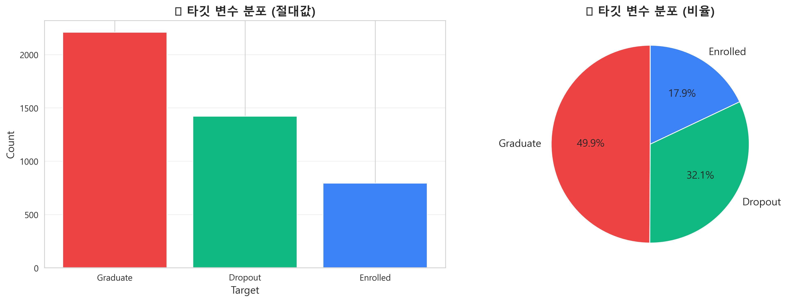
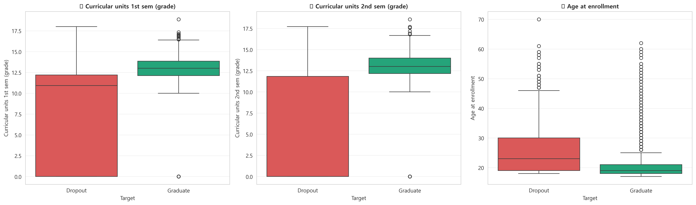
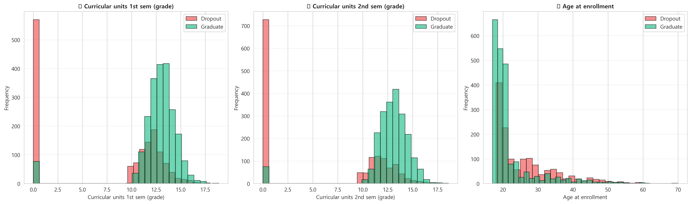
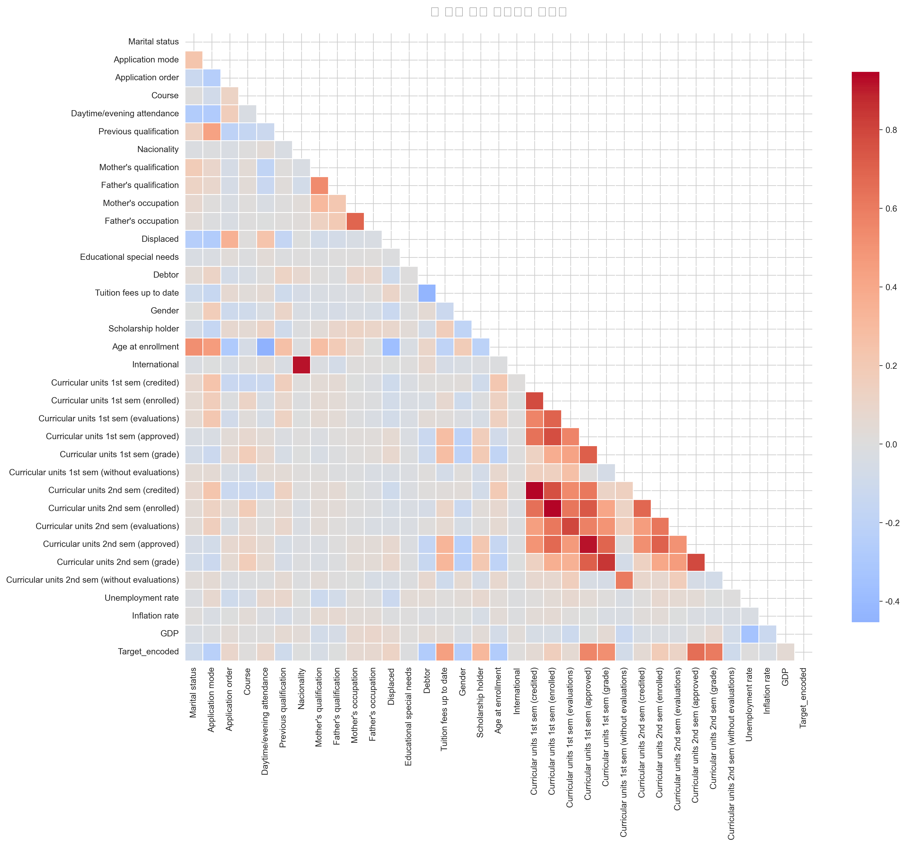
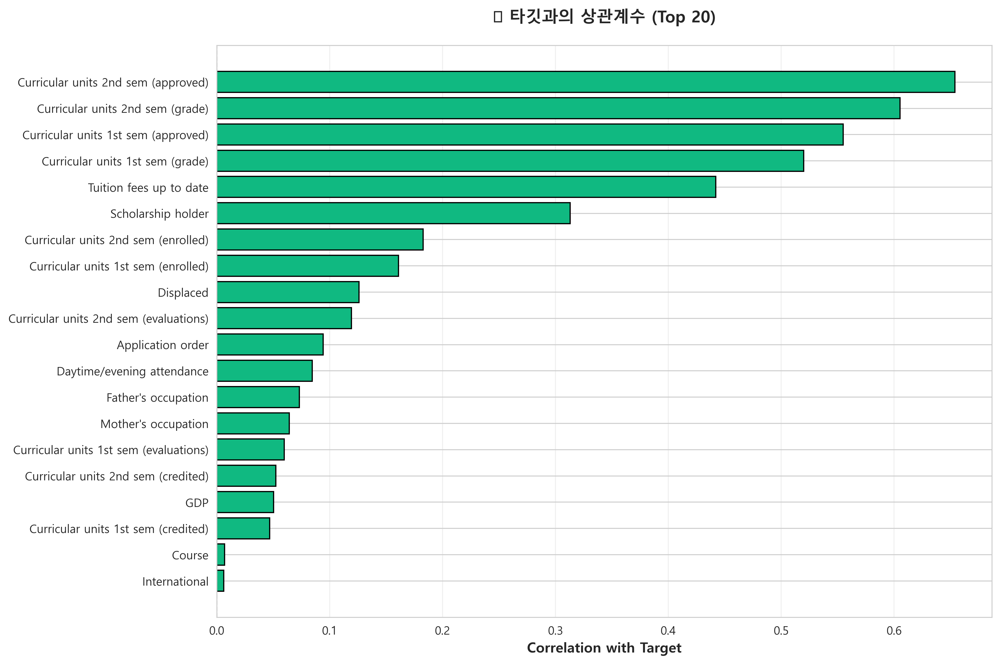

# 📊 데이터 전처리 결과서

**프로젝트명**: 학생 학업 중도 이탈률 예측  
**작성일**: 2025년 11월 4일  
**담당**: Drop Signal Detector Team

---

## 1. 데이터셋 개요

### 1.1 기본 정보
- **데이터 출처**: [Kaggle - Predict Students' Dropout and Academic Success](https://www.kaggle.com/datasets/thedevastator/higher-education-predictors-of-student-retention)
- **데이터 규모**: 4,424명 × 35개 변수
- **타겟 변수**: Target (Dropout, Enrolled, Graduate)
- **데이터 유형**: 수치형 및 범주형 혼합 데이터

### 1.2 데이터 수집 목적
대학생의 학업 중도 이탈(Dropout)을 예측하여 조기에 위험 학생을 식별하고, 적절한 지원을 제공하기 위한 Early Warning System 구축

<div style="page-break-after: always;"></div>

## 2. 탐색적 데이터 분석 (EDA)

### 2.1 타겟 변수 분포

| Target | 건수 | 비율 |
|--------|------|------|
| Graduate | 2,209 | 50.0% |
| Dropout | 1,421 | 32.1% |
| Enrolled | 794 | 17.9% |



**분석 결과**:
- Dropout과 Graduate 간 약간의 불균형 존재 (1.55:1)
- Enrolled 상태는 학습 대상에서 제외 (현재 재학 중으로 결과 미확정)

### 2.2 변수 유형 분류

| 유형 | 개수 | 예시 |
|------|------|------|
| 수치형 변수 | 27개 | Age at enrollment, Curricular units grades, Admission grade, GDP 등 |
| 범주형 변수 | 8개 | Marital status, Application mode, Daytime/evening attendance, Gender 등 |

#### 수치형 변수 분포 (타깃별 비교)




### 2.3 결측치 분석

```
결측치 현황: 없음
```

**결과**: 데이터셋에 결측치가 존재하지 않아 별도의 결측치 처리 불필요

### 2.4 중복 데이터 확인

```
중복 행 개수: 0건
```

**결과**: 중복 데이터 없음

<div style="page-break-after: always;"></div>

## 3. 데이터 정제 과정

### 3.1 타겟 변수 처리

#### Enrolled 제거
```python
removed_enrolled = df.loc[df['Target'] == 'Enrolled'].shape[0]
df = df[df['Target'] != 'Enrolled']
```

**제거 이유**:
- Enrolled 상태는 최종 결과가 확정되지 않은 상태
- 예측 모델의 목적은 Dropout vs Graduate 이진 분류
- 794건 제거 후 3,630건 데이터 사용

#### 타겟 인코딩
```python
TARGET_MAPPING = {'Dropout': 0, 'Graduate': 1}
df['Target'] = df['Target'].map(TARGET_MAPPING)
```

---

### 3.2 불필요한 변수 제거

#### 제거 기준
1. **식별자 컬럼**: ID와 유사한 고유 식별자
2. **상수 컬럼**: 모든 행이 동일한 값
3. **저상관 수치형 컬럼**: 타겟과의 상관계수 절댓값 < 0.02
4. **고카디널리티 범주형 컬럼**: 고유값 비율 > 60%

#### 제거된 변수 (6개)

| 변수명 | 제거 이유 |
|--------|-----------|
| `Course` | 고카디널리티 (17개 고유값) |
| `Nacionality` | 고카디널리티, 분석 목적과 무관 |
| `Unemployment rate` | 타겟과 낮은 상관관계 (< 0.02) |
| `Educational special needs` | 분산이 매우 낮음 (대부분 0) |
| `Father's qualification` | 다중공선성 (Mother's qualification과 중복) |
| `International` | 분산이 매우 낮음 (대부분 0) |

#### 변수 간 상관관계 분석




#### 최종 사용 변수 (28개)

**학적 정보 (3개)**:
- Age at enrollment
- Marital status
- Application mode, Application order

**학업 성취 (12개)**:
- Curricular units 1st sem (credited, enrolled, evaluations, approved, grade, without evaluations)
- Curricular units 2nd sem (credited, enrolled, evaluations, approved, grade, without evaluations)

**재정 정보 (3개)**:
- Debtor
- Tuition fees up to date
- Scholarship holder

**가정 배경 (4개)**:
- Mother's qualification
- Mother's occupation
- Father's occupation
- Displaced

**입학 정보 (3개)**:
- Previous qualification
- Previous qualification (grade)
- Admission grade

**경제 지표 (2개)**:
- GDP
- Inflation rate

**기타 (1개)**:
- Daytime/evening attendance
- Gender

<div style="page-break-after: always;"></div>

## 4. 데이터 변환

### 4.1 수치형 변수 처리

#### StandardScaler 적용
```python
from sklearn.preprocessing import StandardScaler

numeric_transformer = Pipeline([
    ('scaler', StandardScaler()),
])
```

**적용 이유**:
- 변수 간 스케일 차이가 큼 (예: Age 17~70, Grade 0~200)
- 거리 기반 알고리즘 및 경사하강법 수렴 속도 개선
- 특정 변수의 과도한 영향력 방지

**처리 결과**:
- 모든 수치형 변수를 평균 0, 표준편차 1로 정규화
- 이상치에 민감하지만 대부분의 변수가 정규분포에 가까워 적합

---

### 4.2 범주형 변수 처리

#### One-Hot Encoding
```python
from sklearn.preprocessing import OneHotEncoder

categorical_transformer = OneHotEncoder(
    handle_unknown='ignore', 
    sparse_output=False
)
```

**적용 변수**:
- Marital status
- Application mode
- Daytime/evening attendance
- Gender
- Mother's qualification
- Mother's occupation
- Father's occupation
- Previous qualification

**처리 결과**:
- 8개 범주형 변수 → 약 50개 이진 변수로 확장
- 순서가 없는 명목형 변수에 적합
- `handle_unknown='ignore'`로 신규 카테고리 대응

---

### 4.3 전처리 파이프라인 구성

```python
from sklearn.compose import ColumnTransformer
from sklearn.pipeline import Pipeline

preprocessor = ColumnTransformer(
    transformers=[
        ('num', numeric_transformer, numeric_cols),
        ('cat', categorical_transformer, categorical_cols),
    ],
    remainder='drop',
)
```

**장점**:
- 학습/테스트 데이터에 동일한 전처리 자동 적용
- 데이터 누출(Data Leakage) 방지
- 모델과 함께 저장하여 프로덕션 환경에서 재사용 가능

<div style="page-break-after: always;"></div>

## 5. 데이터 분할

### 5.1 Train/Test Split

```python
from sklearn.model_selection import train_test_split

X_train, X_test, y_train, y_test = train_test_split(
    X_processed_df,
    y,
    test_size=0.2,
    stratify=y,
    random_state=42,
)
```

**설정 근거**:
- **Test Size**: 20% (약 726건)
- **Stratify**: 타겟 비율 유지 (클래스 불균형 고려)
- **Random State**: 42 (재현성 확보)

**분할 결과**:

| 구분 | 크기 | Dropout 비율 | Graduate 비율 |
|------|------|--------------|---------------|
| Train | 2,904 | 32.1% | 67.9% |
| Test | 726 | 32.1% | 67.9% |

<div style="page-break-after: always;"></div>

## 6. 클래스 불균형 처리

### 6.1 불균형 현황
- Dropout: Graduate = 1 : 2.1
- 중간 정도의 불균형 (심각하지는 않음)

### 6.2 처리 전략

#### 방법 1: Class Weight 적용
```python
RandomForestClassifier(class_weight='balanced')
```
- 소수 클래스에 더 높은 가중치 부여
- 모델이 Dropout 클래스에 더 집중하도록 유도

#### 방법 2: SMOTE (선택적 적용)
```python
from imblearn.over_sampling import SMOTE

smote = SMOTE(random_state=42)
X_train_balanced, y_train_balanced = smote.fit_resample(X_train, y_train)
```
- 합성 샘플 생성으로 클래스 균형 맞춤
- 과적합 위험 있어 교차 검증 필수

<div style="page-break-after: always;"></div>

## 7. 전처리 결과 요약

### 7.1 최종 데이터셋

| 항목 | 값 |
|------|-----|
| **전체 데이터** | 3,630건 |
| **학습 데이터** | 2,904건 (80%) |
| **테스트 데이터** | 726건 (20%) |
| **특징 수 (원본)** | 28개 |
| **특징 수 (변환 후)** | 약 70개 (One-Hot Encoding 후) |
| **결측치** | 0개 |
| **중복 행** | 0개 |

### 7.2 데이터 품질 평가

| 평가 항목 | 결과 | 비고 |
|----------|------|------|
| 결측치 처리 | ✅ 완료 | 결측치 없음 |
| 이상치 처리 | ✅ 검토 완료 | StandardScaler로 스케일 조정 |
| 중복 제거 | ✅ 완료 | 중복 없음 |
| 변수 선택 | ✅ 완료 | 28개 변수 선정 |
| 스케일링 | ✅ 완료 | StandardScaler 적용 |
| 인코딩 | ✅ 완료 | One-Hot Encoding 적용 |
| 데이터 분할 | ✅ 완료 | 80:20 비율, Stratified |

<div style="page-break-after: always;"></div>

## 8. 다음 단계

전처리가 완료된 데이터는 다음 단계에서 사용됩니다:

1. **모델 학습**: RandomForest, XGBoost, LightGBM 등 다양한 분류 모델 학습
2. **하이퍼파라미터 튜닝**: GridSearchCV, RandomizedSearchCV 활용
3. **모델 평가**: Accuracy, Precision, Recall, F1-score, ROC-AUC 등 종합 평가
4. **Feature Importance 분석**: 중요 변수 도출
5. **모델 배포**: Streamlit 웹 애플리케이션 구현

<div style="page-break-after: always;"></div>

## 9. 참고 자료

- **코드 위치**: `code/test.ipynb`
- **전처리 데이터 저장**: `csv/test.csv`
- **EDA 결과**: `code/EDA_and_Visualization.ipynb`
- **시각화 자료**: `figures/` 폴더

---

**작성자**: Drop Signal Detector Team  
**검토자**: 전체 팀원  
**최종 승인**: 2025년 11월 4일
